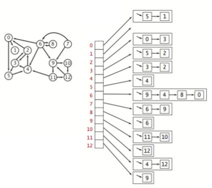

# Lab 4: Graphs


## 1. Directed graphs and its representation

A **graph** consists of 1) a set of nodes and 2) a set of zero or more edges each of which connects two nodes.
**Directed graphs** are a special kind of graph in which the edges have directions (from a *source* node to a *target* node). It is useful for certain tasks, for example, to indicate the flow of data in a network. You can find the definition in [DiGraph.h](DiGraph.h). **Note that each node in the `DiGraph` has an `int` ID and you will use the ID throughout the implementation to refer to a node.**

The `DiGraphAdjList` class declared in [DiGraphAdjList.h](DiGraphAdjList.h) implements the `DiGraph` ADT using **adjacent list**. It maintains an [array of lists](DiGraphAdjList.h#L17) indexed by node ID. Each list stores the adjacent nodes.
Below is an example directed graph and its adjacent list representation.



Functions in [DiGraphAdjList.cpp](DiGraphAdjList.cpp):
- `hasEdge` determine if an edge `v1->v2` is in the graph.
- `addEdge` add edge `v1->v2` to the graph.
- `delEdge` removes edge `v1->v2` from the graph.

## 3. Cycles

A **directed cycle** is a directed path (with at least one edge) whose first and last vertices are the same.
For example, in the above example, path `0->5->4->2->0` is a cycle.
The `hasCycle` function in [DiGraphAdjList.cpp](DiGraphAdjList.cpp#L45) checks if the graph has cycles in it.

[depth-first search](https://en.wikipedia.org/wiki/Depth-first_search). During the search, return true if a node is encountered  twice.

## 4. Build and test

The local repository must first be opened in a Docker container to run tests. In VS Code, click on the "><" button in the bottom-left corner and then select *"Remote-Containers: Reopen in Container"* to open the local repository in a container.
**To get the full-fledged C++ dev environment (including autocompletion, formatting, etc.), you need to install the `clangd` language server when a dialog is prompted and reload the window.**
Next, in the [integrated terminal](https://code.visualstudio.com/docs/editor/integrated-terminal), run the following command to compile and run the code:

```bash
make clean test # this takes time; please be patient
```
